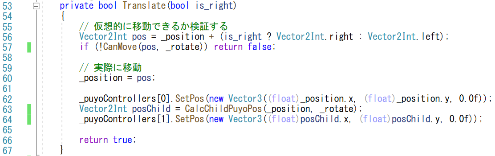
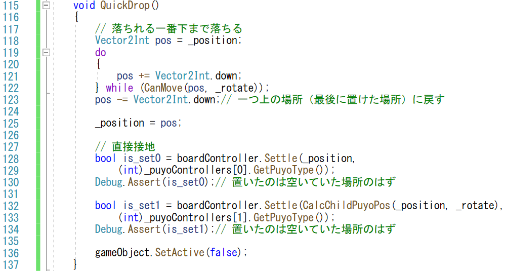

# 概要
前回、ぷよを左右に動かしました。
平行移動は位置を増減させればよいので、比較的簡単です。
今回は、ぷよを回転させましょう。軸ぷよの周りを子ぷよが回ります。
回転では、壁に張り付いたときなどは軸ぷよを動かして回転できたりもするので、その機能も実装してみます。

おまけとして、上を押した時に瞬間的に移動するクイックドロップも実装してみましょう。

# 手順

## 回転の状態の導入
ぷよを回転させるのですが、ぷよぷよでは、ぷよは90度単位でしか回転しません。つまり、子ぷよの位置は、軸ぷよの上・下・左・右だけになります。
このような小数の場合しかない場合は、「状態」を導入して管理するのが定番です。今回は、「RotState」という回転の状態を導入してみます。(7-15行目)

「RotState」はインクリメント・デクリメントと剰余計算で右回転・左回転が簡単に処理できるように上・右・下・左に0から3の順番で整数を割り当てます。初期状態は子ぷよは軸ぷよの上にあるので、「上」を「0」に割り当てました。

- メンバー変数の追加
  - プレイヤーの回転の状態として、位置「_position」に対応するメンバー変数「_rotate」を導入します (21行目)
- 回転した際の位置の計算
  - 「RotState」の値に応じて、子ぷよがどの位置にいるか計算する「CalcChildPuyoPos」を導入します (40-43行目)
    - 「CalcChildPuyoPos」の計算の高速化のために、定数の配列「rotate_tbl」を用意 (38,39行目)
    - 「_rotate」の値を整数に変換して、テーブル引き (42行目)

## 既存コードの修正
今までのソースコードは子ぷよの位置を軸ぷよの上に決め打ちしていたので、その処理を「CalcChildPuyoPos」に置き換えます
- 「Start」メソッドでの子ゲームオブジェクトの位置の設定 (34-35行目)

- 「CanMove」メソッドでの子ゲームオブジェクトの位置の検証の修正 (48行目)

  - 「Translate」メソッドでの子ゲームオブジェクトの位置の検証の修正 (63-64行目)

## 回転操作

回転のキー入力を受け付けましょう。それぞれをキーコードで押し下げを検知します。

- 「x」で右回転を受付け (154行目)
- 「z」で左回転を受付け (158行目)
- 回転のキーが押されたら、(まだ定義していない)「Rotate」メソッドで処理することにしましょう (156, 160行目)

## Rotate メソッド
実際に回転させる処理は、次のステップになります。
- 回転を入力に応じて仮に進めてみる
  - ローカル変数「rot」を導入 (71行目)
  - 「rot」は「_rotate」の値を右回転、左回転に応じて+1, -1する
    - -1した時に負になるのは避けたいので4の剰余を取った際に同じ値になるように-1+4の+3を-1の代わりに行う
  - 「rot」を進めた後、0-3の範囲の値をとるように4の剰余の計算を行う
    - コンピュータに高速に処理する事を明示的に表すように「%4」ではなく「&3」で(「&(4-1)」で)計算する
- 仮想的に動かしてみて、そこに行けないようであれば処理を終える (99行目)
- 動けるようであれば、メンバー変数を更新 (103行目)
- 表示されるゲームオブジェクトの位置を更新 (105-107行目)

これで、xやzキーで回転できるようになります。

## 壁蹴り

先ほどの処理では、回してみて動けない時に動かさないという処理にしました。
じっさいのぷよぷよでは、「壁蹴り」と呼ばれる、一ブロックであれば横や上に移動することで、回転した位置に壁や既に置かれているぷよがあった時でも動かせるようにしています。この処理を組み込んでみましょう。

- 右（左）から下に回転：自分の下か右（左）下が埋まっていれば、位置を引き上げる (78-83行目)
- 上（下）から右に回転：右が埋まっていれば、左に移動 (87行目)
- 上（下）から左に回転：左が埋まっていれば、右に移動 (91行目)

これで、左右に移動して張り付いたときでも回転できるようになりました。

## クイックドロップ
他の操作にクイックドロップがあります。
これは、（通常は、↑）を押すと、一瞬で真下に固定される機能です。
どこに落ちるのかの表示がないと使いにくい機能ではありますが、実装してみましょう。

- クイックドロップの入力
  - 入力としては、↑が押された際に、処理「QuickDrop」を呼び出すようにします (164-167行目)

QuickDropの処理では、軸ぷよと子ぷよを一段ずつ仮想的に落としていって、設置したところでボードの情報を更新します
- 「QuickDrop」メソッドの実装
  - 一段ずつ落とせるか確認して、落とせなくなる直前の場所を取得します (118-123行目)
  - 接地する場所が判明したら、ボードの情報を更新します (128-134行目)
    - 念のため、本当に置けたかどうかをアサーションを使ってすぐわかるようにしました (130, 134行目)
  - ボードにぷよを置いたら、（プレイヤーの方で表示しているぷよを消すため）自分のゲームオブジェクトを非アクティブにします (136行目)

これで、プレイ中に↑を押すと、ぷよが瞬間的に設置するはずです。

